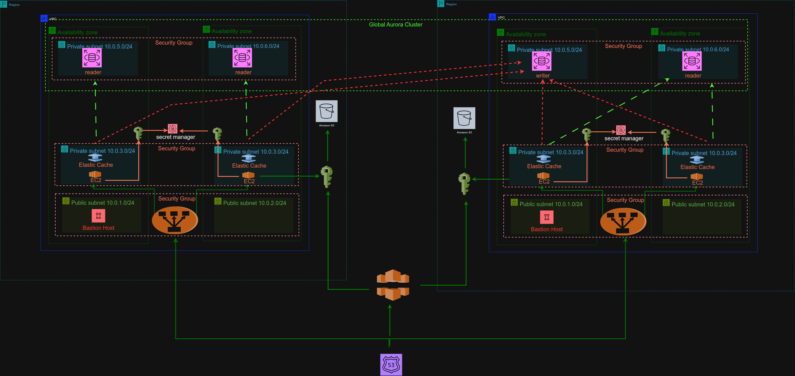

---
# 🌍 AWS Terraform Multi-Region Disaster Recovery (Active-Active)

This repository contains **Terraform configurations** for deploying a **multi-region, active-active disaster recovery (DR)** setup on AWS. It automates infrastructure provisioning, backup strategies, and failover mechanisms to ensure **high availability** and **business continuity** across regions.
---

---

🎥 **Watch the Practical Demonstration and Detailed Explaination on YouTube:**

---
